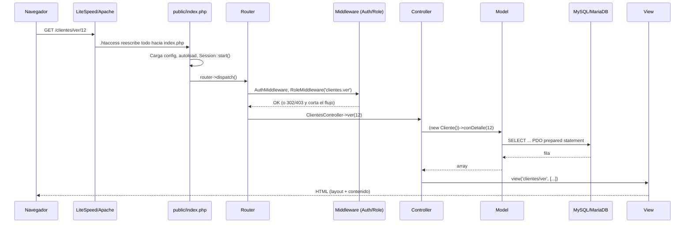
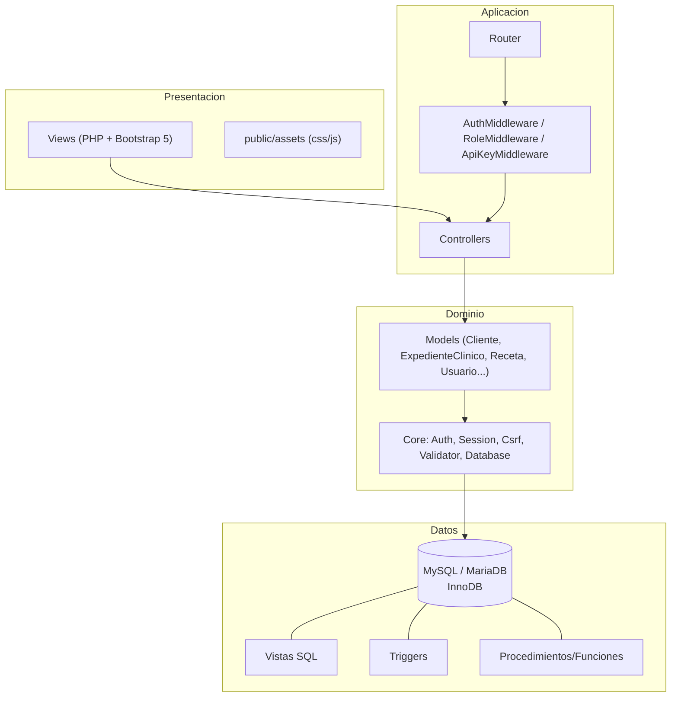

# Arquitectura

## Por qué un MVC propio y no un framework

La especificación fija PHP 7.4+ compatible, hosting compartido típico
(LiteSpeed/cPanel, donde SSH y Composer no siempre están disponibles) y
"código limpio siguiendo estándares PSR". Un framework grande (Laravel,
Symfony) añade una dependencia pesada de Composer que puede no ser viable
en ese entorno y un costo de aprendizaje para el equipo que dé
mantenimiento. Un MVC propio, pequeño y con estándares PSR-4, cubre la
especificación exacta sin ese costo, y es un patrón muy común en software
a medida para el mercado de habla hispana sobre hosting compartido.

**Nota de honestidad técnica:** esto es una decisión de trade-off, no una
verdad absoluta. Si el negocio crece y el equipo de desarrollo se amplía,
migrar los `Controllers`/`Models` a Laravel más adelante es factible
precisamente porque la separación de responsabilidades ya sigue ese
patrón (Router → Controller → Model → View).

## Flujo de una petición

## Capas

## Decisiones de diseño clave

### 1. El stock de inventario tiene una única fuente de verdad
`productos.stock_actual` **nunca** se actualiza directamente desde el
código de la aplicación. Se actualiza exclusivamente por el trigger
`trg_movimientos_inventario_after_insert` cuando se inserta una fila en
`movimientos_inventario`. Esto garantiza que el Kardex (`vista_kardex`)
y el stock reportado **nunca puedan desincronizarse** — son la misma
fuente de datos vista de dos formas.

### 2. Contexto de auditoría vía variables de sesión de MySQL
Los triggers de auditoría (`trg_usuarios_after_update`,
`trg_productos_after_update`) necesitan saber **qué usuario de la
aplicación** hizo el cambio, no solo qué fila cambió. Como un trigger no
recibe ese dato directamente, `Database::setContextoAuditoria()` fija
`@app_usuario_id` y `@app_ip` como variables de sesión MySQL al inicio de
cada petición autenticada (ver `public/index.php`), y los triggers las
leen. El patrón es extensible a cualquier tabla nueva sin cambiar el
código PHP.

### 3. El expediente clínico es un agregado transaccional
Una consulta oftalmológica completa toca hasta 10 tablas (encabezado +
7 secciones 1:1 + diagnósticos + tratamientos). `ExpedienteClinico::
crearCompleto()` envuelve todo en una única transacción
(`Database::transaction()`): o se guarda la consulta completa, o no se
guarda nada. Nunca queda un expediente a medias por un fallo a mitad de
camino.

### 4. Autoloader propio + Composer opcional, no excluyente
`app/Core/autoload.php` es un autoloader PSR-4 minimalista para el
namespace `App\`. El sistema completo (rutas, autenticación, CRUD, API)
funciona con `git clone` + configurar `.env`, **sin ejecutar
`composer install`**. Composer solo se necesita para dos mejoras
opcionales (Dompdf, PHPMailer) — ver `docs/INSTALL.md`. Esto importa en
hosting compartido donde SSH/Composer no siempre están disponibles.

### 5. Sin hard-delete en datos clínicos, financieros o de inventario
Todas las tablas de negocio usan una columna `estado` (`activo`/
`inactivo`, o `activa`/`anulada` en recetas y facturas). El método
`Model::desactivar()` es la vía estándar de "borrado". Esto es
obligatorio en un sistema con historial clínico: un expediente médico no
debe poder desaparecer por un DELETE accidental. Las llaves foráneas usan
`ON DELETE RESTRICT` hacia clientes/usuarios/productos con historial, y
`ON DELETE CASCADE` solo entre una tabla y sus propias filas de detalle
(ej. `facturas` → `facturas_detalle`).

### 6. Multi-tenancy de despliegue (raíz o subdirectorio)
`App\Core\Url` calcula la ruta base a partir de `SCRIPT_NAME`, de modo
que el mismo código funciona igual si el hosting sirve el sistema desde
`https://dominio.com/` o desde `https://dominio.com/sistema/` — muy común
en hosting compartido donde no siempre se puede fijar el document root.

## Seguridad por capas

1. **Red/servidor:** `.htaccess` deniega acceso directo a `app/`, `config/`, `database/`, `storage/`.
2. **Sesión:** cookies `HttpOnly` + `SameSite=Lax`, regeneración de ID cada 30 min, expiración por inactividad.
3. **CSRF:** token de sesión validado en cada POST del área web (la API usa API key en su lugar, no sesión).
4. **Autorización:** `RoleMiddleware` verifica el permiso exacto (`modulo.accion`) antes de ejecutar cualquier controlador protegido.
5. **Datos:** 100% prepared statements vía PDO, cero concatenación de SQL.
6. **Salida:** `e()` (htmlspecialchars) en toda variable impresa en las vistas.
7. **Contraseñas:** `password_hash`/`password_verify` (bcrypt), rehash automático si cambia el costo por defecto de PHP.
8. **Fuerza bruta:** bloqueo de 15 minutos tras 5 intentos fallidos.
9. **Archivos subidos:** validación por MIME real (`finfo`), no por extensión declarada; nombre aleatorio en disco.
10. **Auditoría:** toda acción sensible queda en la tabla `auditoria` con valores antes/después.
