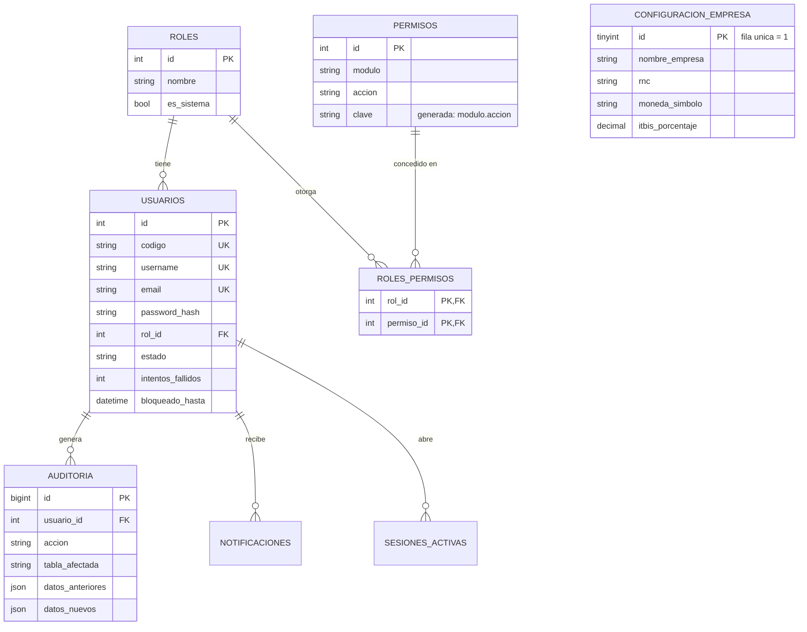
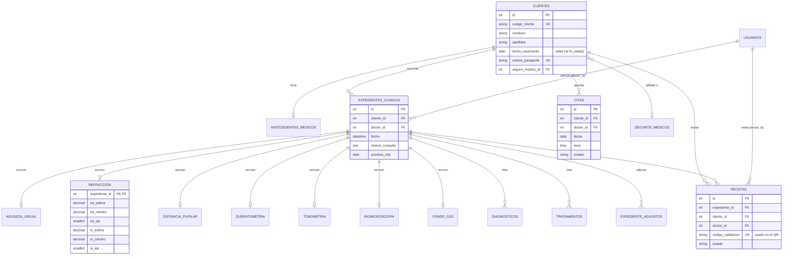
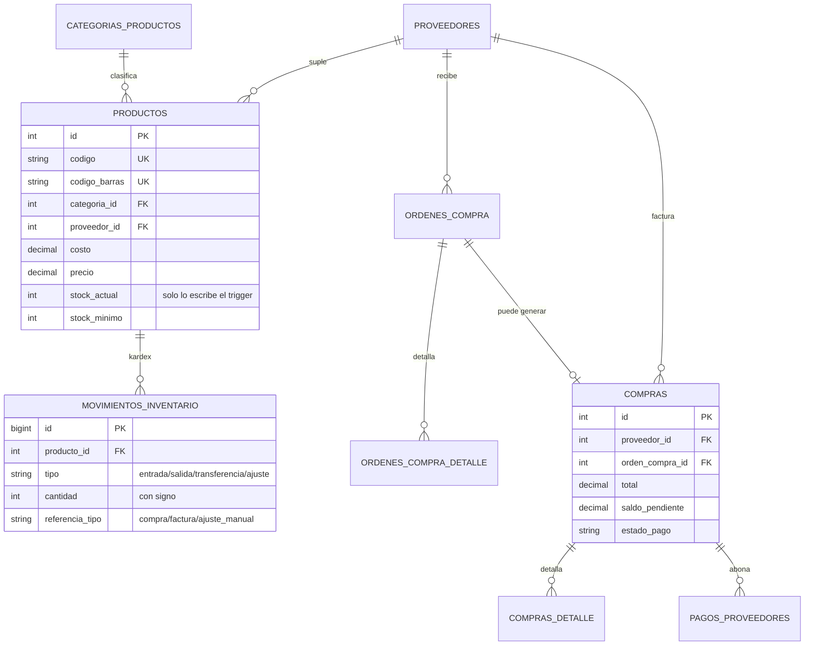
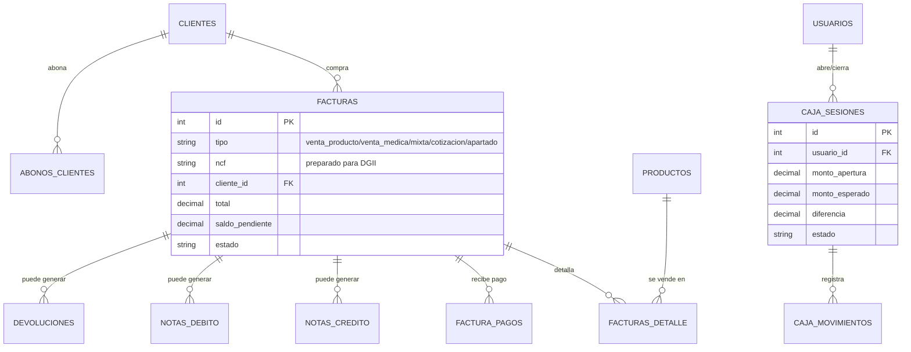

# Diagrama Entidad-Relación

48 tablas en un solo diagrama es ilegible, así que se presenta dividido por
dominio funcional. El esquema completo, con tipos de dato, índices y
comentarios de cada columna, está en `database/schema.sql` (es la fuente
de verdad; estos diagramas son una vista de las relaciones).

## 1. Seguridad, usuarios y configuración

## 2. Clientes e historial clínico oftalmológico

El expediente clínico es un **agregado**: un encabezado con hasta 7
secciones 1:1 y dos listas 1:N. Todas las secciones son opcionales por
consulta (no todas se llenan siempre), por eso están separadas en vez de
una sola tabla ancha con decenas de columnas nulas.

## 3. Inventario y compras

## 4. Facturación, caja y cuentas por cobrar

## Convenciones aplicadas en las 48 tablas

- **Motor:** InnoDB en todas las tablas (requerido para llaves foráneas).
- **Charset:** `utf8mb4` / `utf8mb4_unicode_ci` (soporta acentos, ñ y emoji sin problemas).
- **Claves primarias:** `id` autoincremental `INT UNSIGNED` (o `BIGINT UNSIGNED` en tablas de alto volumen: `auditoria`, `movimientos_inventario`, `notificaciones`).
- **Llaves foráneas:** ver la convención de `ON DELETE` explicada en `docs/ARCHITECTURE.md` (decisión de diseño #5).
- **Índices adicionales:** sobre columnas de búsqueda/filtro frecuente (nombres de cliente, fechas de factura/cita, códigos de barra), más un índice `FULLTEXT` en `clientes` para la búsqueda rápida.
